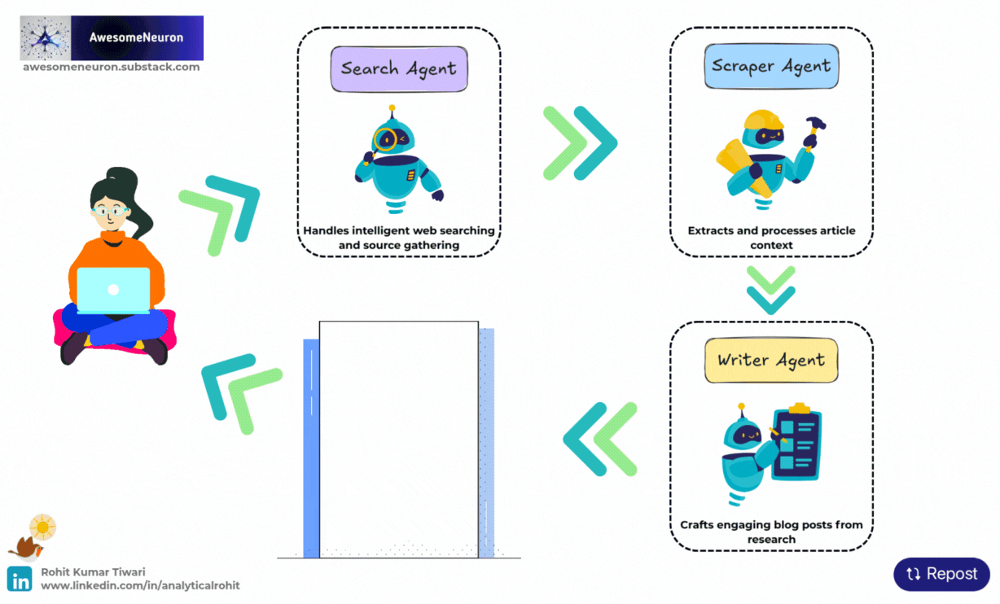
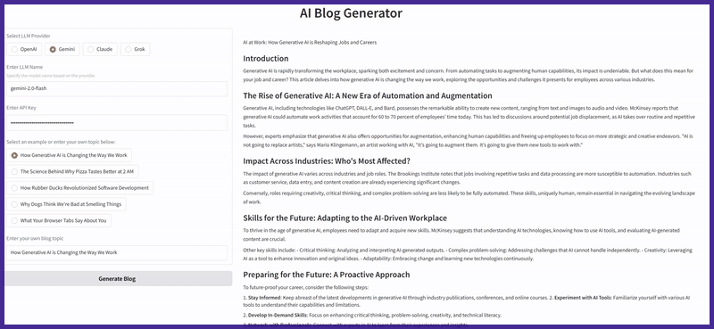
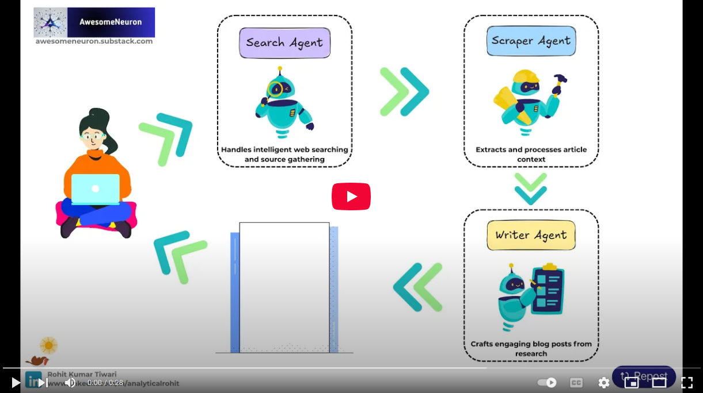

<p align="center">
  <a href="https://www.linkedin.com/in/analyticalrohit" style="text-decoration:none;">
    
  </a>
  <a href="https://awesomeneuron.substack.com/" style="text-decoration:none;">
    
  </a>
   <a href="https://x.com/_rohit_tiwari_" style="text-decoration:none;">
    
  </a>
     <a href="https://www.youtube.com/@awesomeneuron?sub_confirmation=1" style="text-decoration:none;">
    
  </a>
     <a href="https://topmate.io/analyticalrohit" style="text-decoration:none;">
    
  </a>
</p>

# AI Blog Generator

AI Blog Generator is an advanced, multi-agent system for generating professional, well-researched blog posts using the [Agno framework](https://github.com/agno-agi/agno). It supports leading LLM providers including **OpenAI**, **Gemini**, **Claude**, and **Grok**.

<p align="center">
  <a href="https://awesomeneuron.substack.com/">
    
  </a>
</p>
<p align="center">
  <a href="https://awesomeneuron.substack.com/">
    
  </a>
</p>
<p align="center">
  🚀 Launch App &rarr; <a href="https://huggingface.co/spaces/analyticalrohit/ai-blog-generator">https://huggingface.co/spaces/analyticalrohit/ai-blog-generator</a>
</p>

## Features

- **Multi-Agent Workflow:** Orchestrates research, content extraction, and writing using specialized agents.
- **Provider Flexibility:** Easily switch between OpenAI, Gemini, Claude, and Grok models.
- **Research Driven Content:** Finds, evaluates, and cites authoritative sources.
- **Content Scraping:** Extracts and summarizes article content for reference.
- **Gradio UI:** Simple web interface for generating and viewing blog posts.

## Getting Started

### 1. Clone the Repository

```sh
git clone https://github.com/analyticalrohit/ai-blog-generator.git
cd ai-blog-generator
```

### 2. Install Dependencies

```sh
uv venv --python 3.12

uv sync
```

### 3. Run the App

```sh
uv run app.py
```

The Gradio interface will launch in your browser.

## Usage

1. Select your preferred LLM provider and model.
2. Enter your API key.
3. Choose an example topic or enter your own.
4. Click Generate Blog to create a post.

[](https://www.youtube.com/watch?v=smzPuZZMBvs)

## Example Prompts

- How Generative AI is Changing the Way We Work
- The Science Behind Why Pizza Tastes Better at 2 AM
- How Rubber Ducks Revolutionized Software Development

## Project Structure

```
.
├── app.py                        # Gradio web app
├── src/
│   └── ai_blog_generator/
│       ├── agents.py             # Agent definitions
│       ├── generator.py          # Blog post generation workflow
│       ├── model.py              # LLM model (OpenAI, Gemini, Claude, Grok)
│       ├── response_model.py     # Pydantic models for responses
│       └── utils.py              # Utilities
├── pyproject.toml
├── README.md
└── ...
```
## Newsletter
<div style="text-align: left;">
📌 Join 2000+ ML enthusiasts and professionals from 100 countries.<br>
✅ Learn AI for FREE with visuals, easy-to-follow insights.<br>
✅ Get cutting-edge topics like GenAI, RAGs, and LLMs in your inbox every week.
</div>
<br>
<div align="center">

[](https://awesomeneuron.substack.com/)

</div>
<div style="text-align: left;">
    <a href="https://awesomeneuron.substack.com/">
        
</div>
<p align="center">
  <a href="https://awesomeneuron.substack.com/">
    
  </a>
</p>

## Contributing

We welcome contributions from the community! If you have an addition or improvement to suggest:

1. Fork the repository
2. Create your feature branch: `git checkout -b feature/AmazingFeature`
3. Commit your changes: `git commit -m 'Add some AmazingFeature'`
4. Push to the branch: `git push origin feature/AmazingFeature`
5. Open a pull request

## License

This project is licensed under [MIT License](LICENSE).

---

⭐️ If you find this repository helpful, please consider giving it a star!

[](https://www.star-history.com/#analyticalrohit/ai-blog-generator&Date)

Keywords: AI, Machine Learning, Generative AI, LLM, AI Agents, Agentic AI, Agno